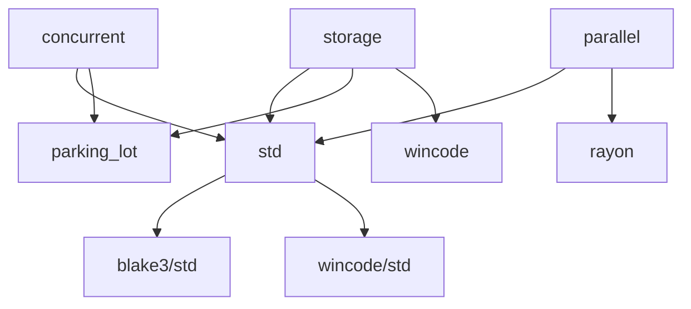

# Feature Flags

RotorTree provides a modular feature system allowing you to enable only the functionality you need. The core algorithm has **zero dependencies** by default.

## Quick Reference

<CardGroup cols={2}>
  <Card title="blake3" icon="hash">
    Default. Provides `Blake3Hasher` adapter
  </Card>
  
  <Card title="std" icon="brackets-curly">
    Standard library support (default via blake3)
  </Card>
  
  <Card title="concurrent" icon="lock">
    Thread-safe `&self` methods with `RwLock`
  </Card>
  
  <Card title="parallel" icon="bolt">
    Rayon-parallelized batch insertions
  </Card>
  
  <Card title="storage" icon="database">
    WAL persistence and checkpointing
  </Card>
  
  <Card title="wincode" icon="binary">
    Fast Solana-style serialization
  </Card>
  
  <Card title="serde" icon="file-code">
    Standard serde serialization
  </Card>
  
  <Card title="test-helpers" icon="flask">
    Testing utilities (dev only)
  </Card>
</CardGroup>

## Feature Combinations

### Minimal (No Dependencies)

```toml
[dependencies]
rotortree = { version = "0.15", default-features = false }
```

**Provides:**
- `LeanIMT` in-memory tree
- `no_std` compatible
- Zero dependencies
- Bring your own hasher (implement `Hasher` trait)

**Best for:**
- Embedded systems
- WASM targets
- ZK circuits (with custom field-aware hasher)
- Minimal binary size

### Default (Blake3 + std)

```toml
[dependencies]
rotortree = "0.15"
```

**Provides:**
- `Blake3Hasher` adapter
- Standard library support
- In-memory `LeanIMT` only

**Dependencies:** `blake3` (1 crate)

**Best for:**
- Most use cases
- Quick prototyping
- When you don't need persistence

### Concurrent (Thread-Safe)

```toml
[dependencies]
rotortree = { version = "0.15", features = ["concurrent"] }
```

**Changes:**
- `LeanIMT` methods take `&self` instead of `&mut self`
- Internal `RwLock` synchronization via `parking_lot`
- Multiple threads can hold snapshots while one thread inserts

**Dependencies:** `blake3`, `parking_lot` (5 crates total)

**API Difference:**

<CodeGroup>
```rust Default (Mutable)
let mut tree = LeanIMT::new(Blake3Hasher);
tree.insert([1u8; 32]).unwrap();
tree.insert([2u8; 32]).unwrap();
```

```rust Concurrent (Shared)
let tree = LeanIMT::new(Blake3Hasher); // No 'mut'
tree.insert([1u8; 32]).unwrap();        // &self method
tree.insert([2u8; 32]).unwrap();

// Can share across threads
let tree = Arc::new(tree);
let tree_clone = Arc::clone(&tree);
thread::spawn(move || {
    tree_clone.insert([3u8; 32]).unwrap();
});
```
</CodeGroup>

**Performance Impact:**
- ~5-10% overhead on single-threaded insertions
- Worthwhile if you need concurrent snapshots + insertions

### Parallel (Rayon-Powered)

```toml
[dependencies]
rotortree = { version = "0.15", features = ["parallel"] }
```

**Provides:**
- Automatic parallelization of `insert_many` for large batches
- Uses rayon work-stealing for optimal CPU utilization

**Dependencies:** `blake3`, `rayon` (~15 crates total)

**Behavior:**
- Parallelism kicks in when parent count exceeds `ROTORTREE_PARALLEL_THRESHOLD` (default: 1024)
- Work is split into chunks of `PAR_CHUNK_SIZE` parents (default: 64)
- Linear speedup up to ~8 cores, then diminishing returns

**Configuration:**

```bash
# Increase threshold for smaller workloads
export ROTORTREE_PARALLEL_THRESHOLD=4096

# Run your application
cargo run --release
```

**Performance:**
- Single-threaded: ~1-2M leaves/sec
- Parallel (8 cores): ~10-20M leaves/sec
- Parallel (14 cores): **~190M leaves/sec** peak

<Warning>
Parallel mode has higher variance in latency. Use single-threaded for predictable performance under load.
</Warning>

### Storage (Persistence)

```toml
[dependencies]
rotortree = { version = "0.15", features = ["storage", "blake3"] }
```

**Provides:**
- `RotorTree` type with WAL persistence
- Crash recovery via WAL replay
- Checkpointing to data files
- Memory-mapped storage tiers
- Durability tokens

**Dependencies:** ~20 crates (includes `parking_lot`, `arc-swap`, `fs4`, `memmap2`, `crc-fast`, `wincode`)

**API:**

```rust
use rotortree::{
    RotorTree, RotorTreeConfig,
    FlushPolicy, CheckpointPolicy, TieringConfig,
};

let config = RotorTreeConfig {
    path: PathBuf::from("/tmp/tree"),
    flush_policy: FlushPolicy::Interval(Duration::from_millis(10)),
    checkpoint_policy: CheckpointPolicy::Manual,
    tiering: TieringConfig::default(),
    verify_checkpoint: true,
};

let tree = RotorTree::<Blake3Hasher, 4, 20>::open(Blake3Hasher, config)?;
```

See the [Persistent Storage guide](/guides/persistent-storage) for details.

### Serialization

#### Wincode (Solana-Style)

```toml
[dependencies]
rotortree = { version = "0.15", features = ["wincode"] }
```

**Provides:**
- `wincode` derives on `NaryProof` and `ConsistencyProof`
- Compatible with Solana's wincode format
- Fastest serialization option

**Usage:**

```rust
let proof = snap.generate_proof(0).unwrap();

// Serialize
let bytes = wincode::serialize(&proof).unwrap();

// Deserialize
let decoded: NaryProof<4, 20> = wincode::deserialize(&bytes).unwrap();
```

<Note>
The `storage` feature automatically includes `wincode` since it's used internally for WAL frames.
</Note>

#### Serde (Standard)

```toml
[dependencies]
rotortree = { version = "0.15", features = ["serde"] }
```

**Provides:**
- Standard `serde` derives on proof types
- Compatible with `serde_json`, `bincode`, `postcard`, etc.
- Better ecosystem compatibility than wincode

**Usage:**

```rust
// JSON
let json = serde_json::to_string(&proof).unwrap();
let decoded: NaryProof<4, 20> = serde_json::from_str(&json).unwrap();

// Bincode
let bytes = bincode::serialize(&proof).unwrap();
let decoded: NaryProof<4, 20> = bincode::deserialize(&bytes).unwrap();
```

<Note>
You can enable both `wincode` and `serde` simultaneously for maximum flexibility.
</Note>

## Complete Feature Matrix

| Feature | Dependencies | Binary Size | Use Case |
|---------|-------------|-------------|----------|
| `default-features = false` | 0 | Minimal | Embedded, WASM, ZK circuits |
| `blake3` (default) | 1 | +50 KB | Standard hashing |
| `std` | via blake3 | +0 KB | Standard library support |
| `concurrent` | +4 | +100 KB | Multi-threaded access |
| `parallel` | +14 | +500 KB | Batch insertion speedup |
| `storage` | +19 | +800 KB | Crash recovery |
| `wincode` | +1 | +50 KB | Solana compatibility |
| `serde` | +2 | +100 KB | Ecosystem serialization |

<Note>
Binary sizes are approximate and include transitive dependencies. Actual size depends on target and optimization level.
</Note>

## Common Configurations

### Web Application (High Throughput)

```toml
[dependencies]
rotortree = { version = "0.15", features = [
    "storage",
    "blake3",
    "parallel",
    "serde",
] }
```

**Use case:** Web server with persistence, fast batch insertions, and JSON API

### Blockchain Full Node

```toml
[dependencies]
rotortree = { version = "0.15", features = [
    "storage",
    "blake3",
    "concurrent",
    "parallel",
] }
```

**Use case:** High-throughput state tree with multiple readers

### Light Client

```toml
[dependencies]
rotortree = { version = "0.15", features = ["blake3", "serde"] }
```

**Use case:** No persistence needed, just proof verification

### ZK Circuit (Custom Field)

```toml
[dependencies]
rotortree = { version = "0.15", default-features = false }
```

**Use case:** Implement `Hasher` trait for field-aware hashing

```rust
use rotortree::{Hasher, Hash, HashState};

#[derive(Clone, Copy)]
struct FieldHasher;

impl Hasher for FieldHasher {
    fn hash_state(&self) -> HashState {
        // Return hasher-specific state
        HashState::new()
    }
    
    fn hash_children(&self, children: &[Hash]) -> Hash {
        // Implement field-aware Poseidon/Pedersen/etc
        todo!()
    }
}

let tree = LeanIMT::<FieldHasher, 2, 20>::new(FieldHasher);
```

### Embedded System

```toml
[dependencies]
rotortree = { version = "0.15", default-features = false }
```

**Use case:** `no_std` environment with custom hasher

## Feature Dependencies

Some features automatically enable others:



<Note>
Enabling `storage` automatically gives you `std`, `wincode`, and several other dependencies.
</Note>

## Runtime Configuration

Some features expose runtime configuration:

### Parallel Threshold

```bash
# Default: 1024 parents
export ROTORTREE_PARALLEL_THRESHOLD=2048
```

Controls when parallelism kicks in for `insert_many`. Higher values = less parallelism overhead for smaller batches.

### Rayon Thread Pool

```rust
rayon::ThreadPoolBuilder::new()
    .num_threads(8)
    .build_global()
    .unwrap();

// Now insert_many will use 8 threads max
```

## Compile-Time Constants

These require source modification and recompilation:

| Constant | Default | Location | Effect |
|----------|---------|----------|--------|
| `CHUNK_SIZE` | 128 | `src/tree.rs` | Hashes per chunk (affects snapshot cost) |
| `CHUNKS_PER_SEGMENT` | 256 | `src/tree.rs` | Chunks per immutable segment |
| `PAR_CHUNK_SIZE` | 64 | `src/tree.rs` | Parents per rayon work unit |
| `MAX_FRAME_PAYLOAD` | 128 MB | `src/storage/frame.rs` | Max WAL frame size |
| `CHUNKS_PER_SHARD` | 65,536 | `src/storage/checkpoint.rs` | Chunks per data file |

See the [Performance Tuning guide](/guides/tuning-performance) for details.

## Feature Recommendations

<AccordionGroup>
  <Accordion title="I need crash recovery">
    Enable `storage` feature:
    ```toml
    rotortree = { version = "0.15", features = ["storage", "blake3"] }
    ```
  </Accordion>
  
  <Accordion title="I'm building a web API">
    Enable `storage`, `parallel`, and `serde`:
    ```toml
    rotortree = { version = "0.15", features = ["storage", "parallel", "serde"] }
    ```
  </Accordion>
  
  <Accordion title="I have multiple reader threads">
    Enable `concurrent` feature:
    ```toml
    rotortree = { version = "0.15", features = ["concurrent"] }
    ```
  </Accordion>
  
  <Accordion title="I want maximum throughput">
    Enable `parallel` and tune `ROTORTREE_PARALLEL_THRESHOLD`:
    ```toml
    rotortree = { version = "0.15", features = ["parallel"] }
    ```
    ```bash
    export ROTORTREE_PARALLEL_THRESHOLD=512
    ```
  </Accordion>
  
  <Accordion title="I'm targeting WASM">
    Disable default features:
    ```toml
    rotortree = { version = "0.15", default-features = false }
    ```
    Implement custom hasher if needed.
  </Accordion>
  
  <Accordion title="I need Solana compatibility">
    Enable `wincode` feature:
    ```toml
    rotortree = { version = "0.15", features = ["wincode"] }
    ```
  </Accordion>
</AccordionGroup>

## Next Steps

<CardGroup cols={2}>
  <Card title="Performance Tuning" icon="gauge" href="/guides/tuning-performance">
    Optimize compile-time and runtime parameters
  </Card>
  
  <Card title="In-Memory Trees" icon="memory" href="/guides/in-memory-tree">
    Learn the basics of LeanIMT
  </Card>
  
  <Card title="Persistent Storage" icon="database" href="/guides/persistent-storage">
    Set up WAL-based persistence
  </Card>
  
  <Card title="Proof Generation" icon="shield-check" href="/guides/proof-generation">
    Generate and verify proofs
  </Card>
</CardGroup>